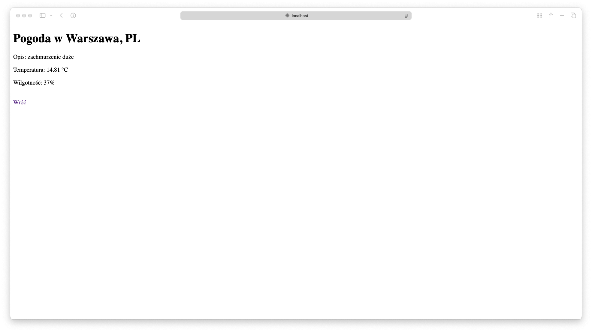

# 🌦️ Weather App

Projekt **Weather App** to aplikacja webowa oparta na Pythonie i Flasku, która pozwala użytkownikowi wybrać kraj i miasto, a następnie pobrać aktualne dane pogodowe z API OpenWeather. Projekt uruchamiany jest w zoptymalizowanym, wieloetapowym kontenerze Docker.

## 📁 Struktura Projektu

```
.
├── app.py
├── requirements.txt
└── Dockerfile
```

## 📄 Opis komponentów

### 🔸 Backend (`app.py`)

- Umożliwia wybór lokalizacji (PL, DE, FR), 
- Pobiera dane pogodowe (temperatura, wilgotność, opis) z OpenWeather(https://openweathermap.org),
- Zapisuje log uruchomienia do pliku app.log,
- Dynamicznie aktualizuje listę miast na podstawie kraju (JS + Jinja),
- Obsługuje błędy i pokazuje komunikaty użytkownikowi.

```py
from flask import Flask, request, render_template_string
import logging
import requests
import datetime

app = Flask(__name__)

# Dane autora
AUTHOR_NAME = "Bahdan Chumak"
TCP_PORT = 5001

# Konfiguracja logowania
logging.basicConfig(level=logging.INFO, filename='app.log', filemode='a',
                    format='%(asctime)s - %(message)s')
x = datetime.datetime.now().strftime("%Y-%m-%d %H:%M:%S")
print(f"Starting app with AUTHOR_NAME=Bahdan Chumak, TCP_PORT=5001, {x}")

# Lista krajów i miast
LOCATIONS = {
    "PL": ["Warszawa", "Kraków", "Gdańsk"],
    "DE": ["Berlin", "Monachium", "Hamburg"],
    "FR": ["Paryż", "Marsylia", "Lyon"]
}

# Strona główna - wybór kraju i miasta
@app.route('/', methods=['GET', 'POST'])
def index():
    if request.method == 'POST':
        country = request.form['country']
        city = request.form['city']
        weather = get_weather(city, country)
        return render_template_string(RESULT_TEMPLATE, city=city, country=country, weather=weather)
    return render_template_string(FORM_TEMPLATE, locations=LOCATIONS)

# Funkcja pobierania pogody
def get_weather(city, country):
    API_KEY = "7bbdfbba46560bb3dd10c4d9512b353e"
    url = f"https://api.openweathermap.org/data/2.5/weather?q={city},{country}&appid={API_KEY}&units=metric&lang=pl"
    print(f"Zapytanie URL: {url}")
    response = requests.get(url)
    print(f"Odpowiedź status code: {response.status_code}")
    print(f"Odpowiedź tekst: {response.text}")
    if response.status_code == 200:
        data = response.json()
        return {
            'description': data['weather'][0]['description'],
            'temperature': data['main']['temp'],
            'humidity': data['main']['humidity']
        }
    else:
        return {"error": "Nie udało się pobrać pogody."}

# Szablony HTML (bez zmian)
FORM_TEMPLATE = """
<!doctype html>
<title>Wybierz lokalizację</title>
<h1>Wybierz kraj i miasto</h1>
<form method="post">
    <select name="country" id="country" onchange="updateCities()">
    
        <option value="{{ country }}">{{ country }}</option>
    
    </select>

    <select name="city" id="city">
    
        <option value="{{ city }}">{{ city }}</option>
    
    </select>

    <input type="submit" value="Pokaż pogodę">
</form>

<script>
    const locations = {{ locations|tojson }};
    function updateCities() {
        const country = document.getElementById('country').value;
        const citySelect = document.getElementById('city');
        citySelect.innerHTML = '';
        locations[country].forEach(function(city) {
            const option = document.createElement('option');
            option.text = city;
            citySelect.add(option);
        });
    }
</script>
"""

RESULT_TEMPLATE = """
<!doctype html>
<title>Wynik</title>
<h1>Pogoda w {{ city }}, {{ country }}</h1>

<p>{{ weather.error }}</p>

<p>Opis: {{ weather.description }}</p>
<p>Temperatura: {{ weather.temperature }} °C</p>
<p>Wilgotność: {{ weather.humidity }}%</p>

<br><a href="/">Wróć</a>
"""

if __name__ == "__main__":
    logging.info(f"Application started by {AUTHOR_NAME} on TCP port {TCP_PORT}")
    app.run(host="0.0.0.0", port=TCP_PORT)
```


Przykładowe logi:
```
Starting app with AUTHOR_NAME=Bahdan Chumak, TCP_PORT=5001, 2025-05-12 14:24:19
```
### 🔸 HTML + JavaScript(generowane dynamicznie)

Frontend renderowany przez Flask zawiera:
	•	formularz wyboru kraju i miasta,
	•	dynamiczne przeładowywanie miast po zmianie kraju,
	•	prezentację wyników pobranych z API pogodowego.


### 🔸 requirements.txt

Plik ten określa wymagane biblioteki Pythona:
```
Flask==2.3.3
requests
```

## 🐳 Dockerfile

Projekt korzysta z wieloetapowego buildu (python:3.11-alpine) z minimalnym środowiskiem wykonawczym:

```
# Etap 1: Build dependencies
FROM python:3.11-alpine AS builder

WORKDIR /app

# Instalacja zależności systemowych (dla C-extensions)
RUN apk add --no-cache build-base libffi-dev

COPY requirements.txt .

# Instalacja zależności do katalogu tymczasowego
RUN pip install --no-cache-dir --prefix=/install -r requirements.txt

# Etap 2: finalny, ultralekki obraz
FROM python:3.11-alpine

LABEL org.opencontainers.image.authors="Bahdan Chumak"

WORKDIR /app

# Tylko potrzebne zależności (z /install z poprzedniego etapu)
COPY --from=builder /install /usr/local

# Kopiujemy aplikację
COPY app.py .

# Zmniejszenie warstw, usunięcie cache
RUN adduser -D appuser && chown -R appuser /app
USER appuser

# Port aplikacji
EXPOSE 5001

# Healthcheck (opcjonalny)
HEALTHCHECK --interval=30s --timeout=5s --start-period=5s --retries=3 \
  CMD wget -qO- http://localhost:5001/ || exit 1

CMD ["python", "app.py"]
```

## 🐳 Docker: Budowanie i uruchamianie

### a. Budowa obrazu kontenera

```bash
docker build -t zadanie1 .
```

### b. Uruchomienie kontenera

```bash
docker run -d -p 5001:5001 --name weather zadanie1
```

### c. Sprawdzenie logów uruchomieniowych

```bash
docker logs weather
```

### d. Sprawdzenie liczby warstw i rozmiaru obrazu

```bash
docker history zadanie1
```

## ✅ Zdrowie Aplikacji

Aplikacja zawiera zdefiniowany HEALTHCHECK, który regularnie sprawdza dostępność głównej strony:

```
HEALTHCHECK --interval=30s --timeout=5s --start-period=5s --retries=3 \
  CMD wget -qO- http://localhost:5001/ || exit 1
```


