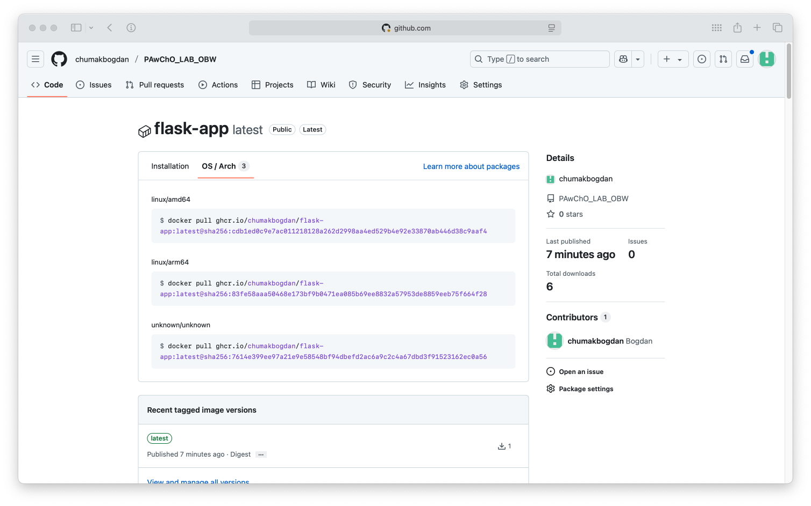

# Zadanie 2

## Cel zadania

Celem zadania było opracowanie łańcucha CI/CD (pipeline) z wykorzystaniem GitHub Actions, który:

----

- Buduje obraz kontenera na podstawie aplikacji napisanej w Pythonie z użyciem Flask (Zadanie 1)
- Wykorzystuje `Dockerfile`
- Wspiera wiele architektur: `linux/amd64` oraz `linux/arm64`
- Wykonuje skanowanie obrazu na obecność luk bezpieczeństwa (CVE)
- Wysyła obraz do publicznego rejestru kontenerów GitHub (`ghcr.io`)
- Wykorzystuje cache warstw Docker BuildKit z rejestrem DockerHub (`mode=max`)

----

## Konfiguracja i wykonanie

### 📁 Struktura repozytorium

```
.
├── app.py
├── Dockerfile
├── requirements.txt
├── .dockerignore
└── .github/
    └── workflows/
        └── docker.yml
```

### Plik workflow: `.github/workflows/docker.yml`

Workflow wykonuje następujące kroki:

#### 1. Checkout repozytorium
```yaml
- name: Checkout repository
  uses: actions/checkout@v3
```

2. Konfiguracja QEMU i Docker Buildx

```yaml
- name: Set up QEMU
  uses: docker/setup-qemu-action@v2

- name: Set up Docker Buildx
  uses: docker/setup-buildx-action@v2
```

3. Logowanie do DockerHub i GHCR

```yaml
- name: Log in to DockerHub
  uses: docker/login-action@v2
  with:
    username: ${{ secrets.DOCKERHUB_USERNAME }}
    password: ${{ secrets.DOCKERHUB_TOKEN }}

- name: Log in to GitHub Container Registry
  uses: docker/login-action@v2
  with:
    registry: ghcr.io
    username: ${{ github.actor }}
    password: ${{ secrets.GITHUB_TOKEN }}
```

4. Budowa i wypchnięcie obrazu multiarch

```yaml
- name: Build and push Docker image
  uses: docker/build-push-action@v5
  with:
    context: .
    platforms: linux/amd64,linux/arm64
    push: true
    tags: ghcr.io/${{ github.repository_owner }}/flask-app:latest
    cache-from: type=registry,ref=docker.io/${{ secrets.DOCKERHUB_USERNAME }}/cache:latest
    cache-to: type=registry,ref=docker.io/${{ secrets.DOCKERHUB_USERNAME }}/cache:latest,mode=max
```

5. Skanowanie obrazu pod kątem podatności

```yaml
- name: Scan image with Trivy
  uses: aquasecurity/trivy-action@v0.28.0
  with:
    image-ref: ghcr.io/${{ github.repository_owner }}/flask-app:latest
    severity: CRITICAL,HIGH
    exit-code: 1
```

6. Użycie cache (registry, mode=max)

```yaml
cache-from: type=registry,ref=docker.io/${{ secrets.DOCKERHUB_USERNAME }}/cache:latest
cache-to: type=registry,ref=docker.io/${{ secrets.DOCKERHUB_USERNAME }}/cache:latest,mode=max
```


### Sekrety w GitHub Actions

Repozytorium zawiera dwa sekrety:
	•	DOCKERHUB_USERNAME
	•	DOCKERHUB_TOKEN (access token z uprawnieniami RW)


### Potwierdzenie działania

Workflow został uruchomiony na gałęzi main i zakończył się sukcesem. Obraz został opublikowany do:

ghcr.io/chumakbogdan/flask-app:latest

Zbudowane architektury:
	•	linux/amd64
	•	linux/arm64


### Tagowanie obrazów

Aktualnie obraz oznaczony jest jako :latest.

Można rozszerzyć o:
	•	:sha-<hash> – unikalny commit
	•	:v1.0.0 – wersja semantyczna

⸻

### Tagowanie cache

Cache przechowywany w DockerHub:

docker.io/chumakbogdan/cache:latest

Z mode=max dla pełnej optymalizacji builda.

## Podsumowanie

| Wymaganie	                                 | Status |
|--------------------------------------------|--------|
| Build z Dockerfile	                     |   ✅   |
| Obsługa architektur linux/amd64, arm64	 |   ✅   |
| Skanowanie CVE (CRITICAL, HIGH)	         |   ✅   |
| Push tylko gdy brak krytycznych podatności |   ✅   |
| Cache registry z mode=max	                 |   ✅   |
| Publiczne repozytorium GHCR	             |   ✅   |

----

## Zrzut ekranu z GHCR

